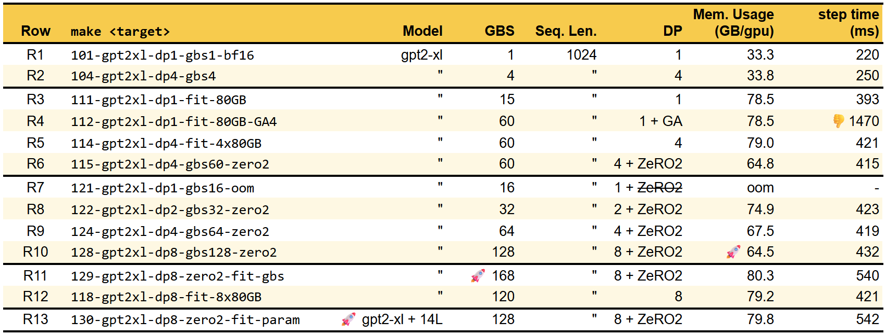
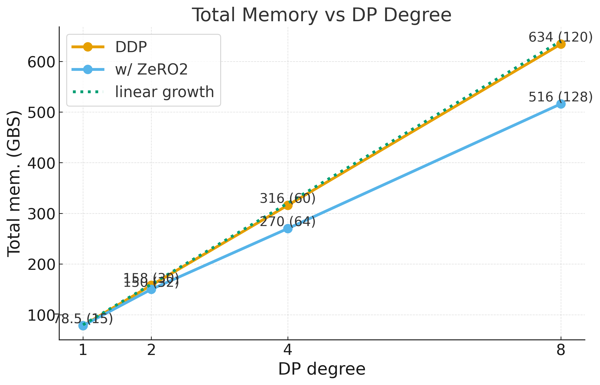

### Data Parallelism & ZeRO-2
*Main reference: [ZeRO paper](https://arxiv.org/abs/1910.02054)*

* Perhaps the most straightforward way to scale training is Data Parallelism (DP), where the model is replicated across GPUs and each replica processes a different subset of a minibatch. You probably have used DistributedDataParallel (DDP) in PyTorch before, which is a DP implementation.

* **DP allows model replication across devices at linear total memory growth at cost of gradient synchronization.** R1 is a baseline training of gpt2-xl (1.5B params) with global batch size (GBS) of 1 on a single GPU. R2 employs DP=4, 4 model replicas to scale the training to 4 GPUs with GBS of 4, each GPU takes a local batch size of 1. Since the workload is simply replicated across GPUs, memory usage per GPU is about the same as R1. Ideally training time per step should remain constant, but we observed that an 14% (30ms) increase in training time, this is due to the communication overhead, the all-reduce of weight gradient from all replicas before stepping the optimizer. We are paying 13% more time to get 4X more data processed. It is not a bad trade off to begin with, it gets better later.

* **When DP is useful?** More often than not, a single GPU can not fit the required batch size even a model can fit within its memory capacity. To illustrate this, R3 shows that a single 80GB gpu can fit up to a maximum batch size of 15. With DP=4 in R5, total batch size can scale proportionally to 60. Note that the communication overhead becomes less significant with larger batch sizes, 421 vs 393, about 6.5% because of ratio of communication to computation decreases with larger batch sizes.

* **Is it possible to achieve GBS of 60 with a single card? Use Gradient Accumulation (GA)**. GA enables larger effective batch sizes on limited memory capacity by accumulating gradients across multiple micro-batches before a weight update. A training step consists of: (1) forward, (2) backward, and (3) optimizer step. GA splits the global batch size (GBS) into smaller micro-batches (MBS). To preserve equivalent training behavior, the model processes each micro-batch sequentially, running forward + backward `GBS/MBS` times to *accumulate* gradients incrementally for the full GBS, and finally performs a single optimizer step. R4 is a demonstration of gradient accumulation with MBS=15, GBS=60 on a single gpu training a gpt2-xl. That means `60/15=4` loops of forward + backward are performed before a weight update. The step time has increased significantly by 3.7X (1470/393) because of the sequential execution of microbatch. It should be apparent that this is a workaround memory constraints and only be used when necessary.

* Now that we fit 60 GBS with DP4 in R5, the question is **can we do better**, fitting larger batch size without more gpus? **Enter ZeRO (Zero Redundancy Optimizer)**, which is a memory optimization technique that shards optimizer states, gradients, and parameters across data-parallel replicas.

* The main redundancy of naive DP is that **each replica maintains a full copy of optimizer states, gradients and parameters (weights)**, which can be a bloated 16-20 bytes per parameter depending on the storage precision. Back in 2019 when ZeRO landed, the top-tier GPU was a V100 with 32 GB. Do the math: `32 GB / ~20 bytes ~= 1.6B parameters` max model size and that's before accounting activations. In other words, with plain DP, we are already out of memory for a small 😂 LLM today (2025) before the training starts. This redundancy not only limits model size, also attenuates batch scaling which is what DP is mainly for.

* ZeRO asks *"Where Did All the Memory Go?"* We follow the paper analysis on GPT2-XL using Megatron-LM. Let's go to the log of R1, or run it again, R1 is a good setup because we use a minimal input, batch size of 1 so that the monitored memory footprint reflects mostly the usage by model parameters, gradients and model optimizers. Following are the snapshot of the live memory usage and the breakdown by Megatron-LM.
    ```bash
    $ monitor-gpu
    [0] NVIDIA H100 80GB HBM3 | 38°C,  53 % | 33321 / 81559 MB | root(33314M)
    ```
    ```
    Number of parameters in transformer block in billions:  1.47
    Number of parameters in embedding layers in billions: 0.08
    Total number of parameters in billions: 1.56
    Number of parameters in most loaded shard in billions: 1.5554
    Theoretical memory footprints: weight and optimizer=26699.47 MB
    ```
* Diving into the logs above:
    1. Number of parameters of gpt2-xl: 1.56B
    2. Theoretical memory footprints: weight and optimizer=26699.47 MB; this is close to ZeRO paper's discussion ("at least 24GB"). 
    3. With batch size of 1, it is consuming >=33GB of GPU memory, verifying the paper claim of overflowing V100-32GB.
    4. **Important**: Based on our examination on BF16 training in Megatron-LM, the storage precision as follows:
        * gradient is stored in FP32 (4 bytes) as opposed to 16-bit used in the paper. 
        * optimizer's weight copy in FP32 (4 bytes), 
        * optimizer's momentum in FP32 (4 bytes),
        * optimizer's variance in FP32 (4 bytes), 
        * weights are stored in BF16 (2 bytes).
        * Each parameter requires 18 bytes/param as opposed to 16 bytes/param in the paper. Therefore, 1.56B*18b=28.08GB of memory needed for param related memory. The observed 33GB usage makes sense because it includes activation memory and temporary buffer needed for input batch size of 1. The theoretical memory footprint (26.7GB) in the log is slightly lower because it only accounts for transformer block and no embedding while the param count includes. (Yes, we did rootcause it in the code, you can also do the math with log above). 

* **ZeRO-DP overcomes the memory redundancy by progressive stages of memory partitioning.** ZeRO-1 shards optimizer states across data-parallel replicas. **ZeRO-2** builds on that by also sharding gradients. ZeRO-3 takes it further by partitioning parameters. In Megatron-LM, Zero-3's parameter sharding coincides with Tensor Parallelism (TP), only ZeRO-2 is available via `--use-distributed-optimizer`. For reference, Fully-Sharded DP (FSDP) in PyTorch is another implementation of ZeRO. Yes, many names for the same idea. 🙂

* **What does ZeRO-2 actually entail?** It means the total memory of optimizer states and gradients remains constant over any number of DP replicas because they are sharded across replicas instead of being fully replicated. Without ZeRO-2, DP is a multiplier of the total memory for optimizer states and gradients. With ZeRO-2, DP has zero effect on the total memory of optimizer states and gradients, except parameters are replicated (ZeRO-3 is the one shards it). It frees up significant memory that can be used to scale batch size or model size. A quick experiment is R6 which is R5 with ZeRO-2 enabled. At DP=4, the memory usage drops from 79GB to 65GB per gpu, close to 18% of savings. 
    
* **ZeRO-2 enhances DP with sublinear memory growth when scaling replicas.**
    * R7-R10 scales DP from 1 to 8 with ZeRO-2 enabled while also scaling GBS proportionally. We see that memory usage per GPU keeps decreasing as we add more DP replicas because optimizer states and gradients are sharded more ways. With 8 GPUs in R10, each gpu only needs to store 1/8 of optimizer states and gradients, memory usage drops to 65GB/gpu. Alternatively, we plot the total memory usage across all gpus below to illustrate the sub-linear growth of memory usage with ZeRO-2 when scaling DP. Plain DDP closely tracks the linear growth of memory usage while ZeRO-2 shows a clear **sub-linear** growth.

        
    
* **In terms of training steps time**, with ZeRO-2, in principle, the communication volume and computation load are about the same as plain DP although the pattern differs because of sharding. See paper for the detailed discussion. Therefore, training step time should be similar between ZeRO-2 and plain DP (R5 vs R6), and constant time when scaling batch size proportionally with DP replicas (R7-R10).

* **Batch Size and Model Size Liberated!** With the surplus memory enabled by ZeRO-2, we can fit larger batch sizes, larger models, or both.
    * Larger Batch Size: With plain DP=8 (R12), the maximum GBS is 120, ZeRO-2 enables GBS up to 168 (R11), that is 1.4X larger batch size! That is also 40 more that 128 in R10.
    * Larger Model Size: R13 explores how many more transformer layers we can add on top of R10 with the saved memory from ZeRO-2. We can add 14 more layers on top of gpt2-xl's 48 layers, scaling param from 1.56B to 1.99B that is 1.275X more capacity! Now imagine we have nodes of GPUs, can scale to even larger models. Table 1 in the paper shows that model up to 1 trillion parameters are theoretically possible with ZeRO-3 on a cluster of 1024 V100-32 GB GPUs (DP=1024) while having half of the memory available per gpu for activation memory.

* Additional exercises:    
    1. Modify R1 to gbs=4 so it functions like a R2, observe, contrast and reason about the elapse time per iteration and memory usage? (step time should be slightly lower than R2 because no gradient synchronization overhead, no communication over nvlink. Memory usage should be around 43GB, because of larger batch size on a single device.)
    1. Ablate `--use-distributed-optimizer`, `--overlap-grad-reduce`, `--overlap-param-gather`, what do we observe?
    1. Take R9, play with scaling batch and parameters, how far can you go before oom?

