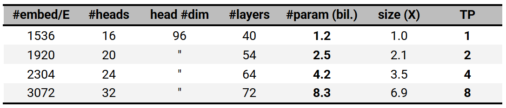
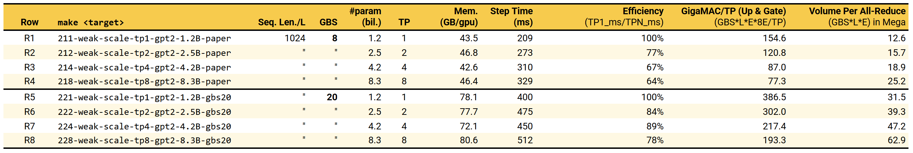
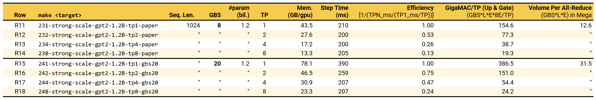
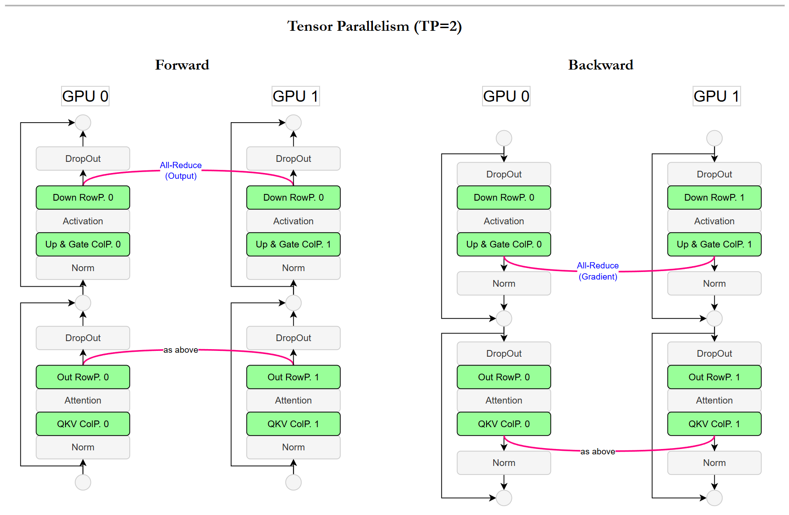
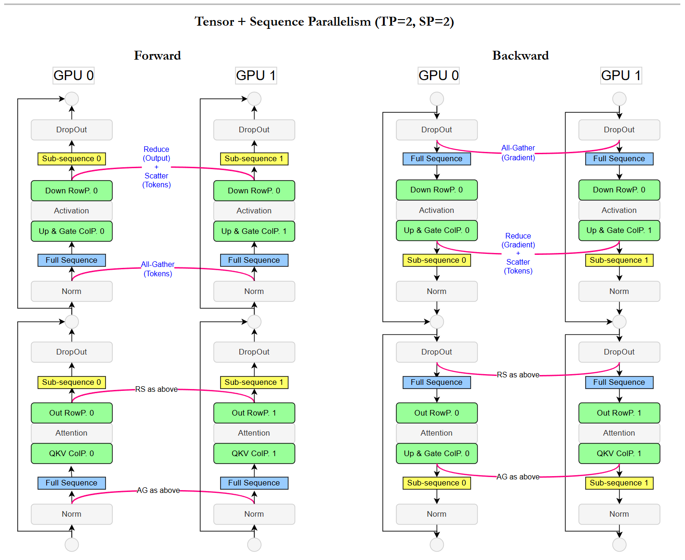

Jump to
* [Tensor Parallelism (TP)](#tensor-parallelism)
* [Weak Scaling with TP](#weak-scaling)
* [Strong Scaling with TP](#strong-scaling)
* [PyTorch Model Summary of Megatron's GPT-22B](#pytorch-model-summary-of-megatrons-gpt-22b)
* [Sequence Parallelism (SP)](#sequence-parallelism)
* [Diagram of TP/SP Collectives](#diagram-of-tpsp-collectives)
* [Activation Recomputation](#activation-recomputation)


In the previous [section](./01-dp-zero2.md), we saw how ZeRO/FSDP reduces memory tied to model states, enabling larger batch sizes and scaling to more parameters. Activation memory grows with batch size while larger batch and model size drive up compute, eventually becoming the bottleneck. At this point, data-parallel memory tricks aren't enough, we need to split the computation itself to continue scaling performance (throughput), while also tapping into the aggregate memory bandwidth and capacity across multiple GPUs.

In this section, we explore **Tensor Parallelism (TP)**, a model-parallel technique that partitions both compute and memory within individual layers of a neural network across multiple GPUs. We will also see how **Sequence Parallelism (SP)** complements TP by reducing activation memory further.

--------------
### Tensor Parallelism

*Main reference: [Megatron-LM paper][rtp]*

A full deep dive on TP is out of scope, but here we give an overview and clarify a few subtleties, especially naming conventions and contrast against ZeRO-3.

In Megatron-LM, TP means splitting the weight storage and compute of linear layers across multiple GPUs, specifically the projections, vocab embedding, and language head layers of transformer model. The partitioning is only on 1-dimensional, applied either along the output-channel dimension (column-parallel) or the input-channel dimension (row-parallel) depending on the layer type and data flow. While 2D sharding and other schemes exist in the literature, Megatron-LM's TP is strictly 1D weight sharding and weight-stationary model (i.e. keep sharded weights local, communicate activations around).

Inside a Megatron-LM decoder block:
* Q, K, V projections are fused into a single `ColParallelLinear`
* Output projection is `RowParallelLinear`
* In the MLP, Up + Gate are fused into `ColParallelLinear`
* Down projection is `RowParallelLinear`

This design streamlines communication: only 2 all-reduces at the output of `RowParallelLinear` in forward, and 2 all-reduces to complete backprop in `ColParallelLinear`. See paper for detailed discussion.

IMHO, better names would be OC-parallel for Column-parallel and IC-parallel for Row-parallel since PyTorch stores linear weights as (output channel, input channel). See that? OC/IC is much clearer on which axis we're slicing.

**How TP differs from ZeRO-3?** ZeRO-3 shards parameters and the key distinction is that ZeRO-3 does not distribute the compute, it only distributes storage. In ZeRO-3, param shards are all-gathered in each replica during forward and backward for full computation. TP does both, storing a shard of the parameters and each GPU computes its slice and communicates partial results. In short, ZeRO-3 = distributed storage; TP = distributed storage + distributed compute.

That’s about it for the TP overview. One more subtlety: TP for input/output embeddings in today's Megatron-LM implementation differs from the original paper in term of the slicing dimension. We're not diving into that variant here because it is lower in priority, but it's worth flagging so you don't get confused when cross-referencing the paper with the current Megatron's code.

So how we will go about studying the scaling effects of TP? Fortunately, with a single node of 8x A/H100 80GB GPUs, we can reproduce some setups and empirical trends of the original paper. We will focus on two aspects: Weak  and Strong scaling.

### Weak Scaling 
*- Our experiments correspond to [Paper][rtp]'s Section 5.1, Table 1, Figure 5*

**Concept Clarifier**: Weak scaling involves increasing the problem size proportionally to the number of processors such that each processor performs roughly the same amount of work. This is often instantiated by fixing the per-GPU batch size and allowing the global batch size to grow with the number of GPUs, that is more of DP notion, it does not address model size scaling. Hence, the paper holds a looser notion of weak scaling, focusing on scaling model capacity, i.e. increasing parameter count proportionally with TP while keeping the effective batch size fixed. In a way, think of it as keeping roughly the same amount of learning (problem size) per TP shard (processor), reflecting a weak-scaling notion. The table below lists the models used for weak-scaling experiments, following the original paper. Model size scales roughly proportionally with the TP degree by adjusting the model configuration.





**Row R1-R4**

1. **R1–R4 captures runtime metrics per paper setup for training the TP-scaled models.** We see that memory usage per GPU remains approximately constant, since both model parameters and activation memory are distributed uniformly (roughly speaking) across TP shards. E.g. an 8.3B-parameter model with TP=8 results in ~1B parameters per shard, which is comparable to the 1.2B parameters in the TP=1 configuration.

2. **Training step time increases considerably as we scale TP and model size.** We observe a gradual rise from 209 ms (R1) to 329 ms (R4). Under ideal weak scaling, step time would remain constant since each GPU performs the same amount of work. But recall that the way we weak-scale here is by growing model size via different hyperparameters, that changes both the per-GPU workload and the communication volume. As shown in the table, communication doubles from R1 to R4, so constant step time is not expected because essentially load per device has changed.

3. **The measured scaling efficiency drops to 64% at TP=8 (R4), lower than the 77% reported in the paper.** This discrepancy is likely due to hardware differences: our experiments use H100, whereas the paper uses V100. The H100's higher compute throughput makes communication ratio to compute more pronounced and lowering the scaling efficiency.

**Row R5-R8**

4.  **Scaling efficiency improves with larger batch size.** R5–R8 repeat the weak-scaling experiments using a larger GBS of 20 (vs. 8 in R1–R4), chosen to fully utilize the available GPU memory. With this larger batch, we now reproduce the trend reported in the paper, we achieve 78% scaling efficiency at TP=8 (R8), closely matching the paper’s 77%. Close enough? 🙂 Larger batches increase the amount of computation per GPU, better saturating the compute units and enlarging the compute-to-communication ratio, which in turn makes communication overhead less noticeable.

### Strong Scaling
*- per [Paper][rtp]'s Appendix D.2*

Contrary to weak scaling, strong scaling fixes the total problem size while increasing the number of processors. In our context, we keep the model size and global batch size constant while varying the TP degree. This setup helps us understand how effectively we can speed up training for a fixed model and workload by leveraging more GPUs through TP. Note that strong scaling here aligns to actual strong scaling definition, unlike the proxy weak scaling discussion above.



**R11-R14**

1. **Memory decreases with higher TP.** R11-R14 follows the paper setup, carrying out strong scaling experiments on a fixed 1.2B-parameter model with GBS of 8, varying TP from 1 to 8. The memory usage per GPU decreases as we increase TP, since model parameters and activations are partitioned across more GPUs.
1. **No step-time improvement at small batch.** Ideal strong scaling expects proportionate decrease in training time, linearly with TP degree. Yet, we observe no improvement. What is going on? Well same devil at play in weak scaling above, compute per GPU is too low on H100, communication dominates compute, amplifying further with higher TP.

**R15-R18**

3. **Increasing batch size reveals scaling gains.** Now, let's saturate the compute by filling up the memory with larger batch size in R15-R18. With GBS of 20, at TP4, step time nearly halves (390/207). This demonstrates the benefit of TP when compute load is substantial, sharing computation, as well as distributing memory load.

4. **Diminishing returns and a classic Amdahl's law in action** From TP=4 to TP=8, step time barely changes. This is expected. As TP increases, the parallel portion (linear layers) shrinks per GPU, while the non-parallelizable operations (communication, synchronization, scheduling) become dominant. In essence, once compute per GPU becomes small, additional TP provides minimal benefit. This also explains why TP has no speedup effect when GBS is small (R11-R14).

5. **No need to feel discouraged by the strong-scaling efficiency**. The paper does not explicitly report the number in Appendix D.5, but by calculation, it is 33.6%, compared to 24% in our TP=8 case (R18). Expected as V100 is significantly less compute-capable than H100, effect of compute sharing is more visible. Strong scaling is generally a stricter test, challenging because it assumes every component, including cost of distribution/collection to scale linearly. The table shows constant communication volume across TP ranks during strong scaling. In practice, there are more non-linearly scaled components.


**Revision notes:**
1. theoretical compute? 
1. detail how to calculate comm volume
1. disconnection between weak and strong
1. amdahl's law graph
1. Challenging claim
-----------
#### *PyTorch Model Summary of Megatron's GPT-22B*
```
GPTModel(
  (embedding): LanguageModelEmbedding(
    (word_embeddings): VocabParallelEmbedding()
    (position_embeddings): Embedding(1024, 2304)
    (embedding_dropout): Dropout(p=0.1, inplace=False)
  )
  (decoder): TransformerBlock(
    (layers): ModuleList(
      (0-15): 16 x TransformerLayer(
        (input_layernorm): IdentityOp()
        (self_attention): SelfAttention(
          (core_attention): TEDotProductAttention(
            (flash_attention): FlashAttention()
            (fused_attention): FusedAttention()
            (unfused_attention): UnfusedDotProductAttention(
              (scale_mask_softmax): FusedScaleMaskSoftmax()
              (attention_dropout): Dropout(p=0.1, inplace=False)
            )
          )
          (linear_proj): TERowParallelLinear(in_features=2304, out_features=2304, bias=True, TP=1)
          (linear_qkv): TELayerNormColumnParallelLinear(in_features=2304, out_features=6912, bias=True, TP=1)
          (q_layernorm): IdentityOp()
          (k_layernorm): IdentityOp()
        )
        (pre_cross_attn_layernorm): IdentityOp()
        (cross_attention): IdentityOp()
        (cross_attn_bda): IdentityFuncOp()
        (pre_mlp_layernorm): IdentityOp()
        (mlp): MLP(
          (linear_fc1): TELayerNormColumnParallelLinear(in_features=2304, out_features=9216, bias=True, TP=1)
          (linear_fc2): TERowParallelLinear(in_features=9216, out_features=2304, bias=True, TP=1)
        )
      )
    )
  )
)
```
-----------
### Sequence Parallelism

*Main reference: [Reducing Activation Recomputation in Large Transformers]()*

Thus far, we have discussed DP, ZeRO, and TP. Combining them can train fairly large models, but not to the humongous scales seen today. To push further, we must address another source of redundancy linked to the sequence dimension. Sequence length has scaled rapidly, from 512 in BERT, to 1,024 in GPT-2, to 2,048 in GPT-3. Today, leading assistants typically support ~128K tokens, and dedicated long-context continued-pretraining has become the norm for extending the window beyond the narrower one used during the base pretraining stage.

Scaling sequence length directly inflates activation memory, often dramatically. It impacts nearly every component in a Transformer, and training compounds the problem since activations must be retained until backpropagation consumes them. Worse, while TP alleviates activation memory in linear projections by sharding input/output channels, activations of layers remain fully replicated across TP ranks. As TP ranks increase on top of long sequence lengths, this replication becomes a major redundancy, motivating techniques that parallelize along the sequence dimension itself.

**Sequence Parallelism (SP)**, as literal as it sounds, splits the input sequences across multiple GPUs. You may anticipate (at least I did) that "sequence" parallelism would apply to all operations on token activations, including attention, since every layer operates over token latents. However, in Megatron-LM's terminology, SP has a narrower scope: it shards only token-independent operations like dropout, normalization (LayerNorm, RMSNorm, etc). These layers have no cross-token dependency, so they cleanly distribute activation memory requirement, (and technically compute as well, although the compute here is insignificant). How about attention layers? Splitting sequences for attention is termed **Context Parallelism (CP)** in Megatron 😅😈, which we discuss in the next chapter.
#### Diagram of TP/SP Collectives



> Each TP rank holds 1/2 channels. All-Reduce restores full activation (fwd) or gradient (bwd). Here, normalization and dropout run replicated across TP ranks, doing redundant work and storing redundant activations; later, SP shards these along the sequence dimension.



> SP replaces TP all-reduces with reduce-scatter + all-gather, allowing Normalization/Dropout to run on subsequences.

We suggest referring to the paper for full details, but here we summarize the key mechanics alongside the diagram above. SP is typically used in conjunction with TP. In Megatron, it is enabled with a single flag, `--sequence-parallel`. When enabled, SP simply rides on the TP grouping, meaning **SP degree = TP degree**, and the sequence dimension is sharded the same TP-way. SP changes the TP communication patterns slightly. TP's original all-reduce in the forward pass (used to form full activations) become reduce-scatter, which reduces the row-parallel linear outputs and splits them into sub-sequences before dropout. Each GPU then applies layer normalization on its sub-sequence shard, after which an *all-gather* restores the full sequence before the column-parallel linear. The backward pass mirrors this pattern in reverse, what the paper refers to as conjugate collectives. **In short, the 4 all-reduces per transformer layer in pure TP turn into 8 collectives with SP enabled: 4 reduce-scatters + 4 all-gathers.** The paper notes that the total communication bandwidth remains identical between the two, I'll take their word for it for now 😅 One day we'll all go deep into NCCL traces.

Alright, let's see how SP affects memory and training speed. At this point, the paper experiments involved model scale that requires multi-node setup, thankfully there is still a model that we could replicate on a single node of 8x H100 80GB GPUs. Row 1 of Table 3 in the paper:

| **GPT-22B Model**       | cfg    |
|-------------------------|--------|
| Attention Heads         | 64     |
| Hidden Size             | 6144   |
| Layers                  | 48     |
| Vocab                   | 51,200 |
| Tensor Parallel (TP)    | 8      |
| Number of GPUs          | 8      |
| Global Batch Size (GBS) | 4      |
| Sequence Length         | 2048   |

**C1 and C2**

Recall from the [DP section](./01-dp-zero2.md) that the total footprint for model parameters and optimizer states (Adam) is roughly 18 bytes per parameter, per Megatron-LM implementation. For a 22B-parameter model, this amounts to ~396 GB, clearly exceeding the capacity of a single GPU. With TP=8, the parameters and optimizer states are sharded across 8 GPUs, reducing the per-GPU requirement to ~49.5 GB. The remaining GPU memory must accommodate activations. In C1, even with a GBS of 4 and a modest 2048 sequence length (much smaller than today's), the memory usage already exceeds 640 GB across 8×H100, leading to out-of-memory error (oom).

By enabling `--sequence-parallel` (C2) where SP=8 follows the TP group by Megatron's design, we observe a substantial reduction in activation memory, bringing usage down to ~62 GB per GPU. Now, GPT-22B becomes trainable on 8×H100 80GB without oom, with a total footprint of ~496 GB, consuming only ~78% of the available memory.


#### Activation Recomputation
Any alternative to SP? Activation Recomputation (also known as gradient/activation checkpointing). Quick refresher: during training, the input activation of each layer (i.e., the output of the previous layer) may need to be kept in memory so that backpropagation can compute gradients later. What to save depends on the kind of operations, without needing to go into details, we just take the worst-case mental model, assume we must store all intermediate activations during the forward pass. This obviously leads to large memory usage.

Activation recomputation changes this by only saving (checkpointing) some of the activations, a simple example would be every other layer. Then, during backpropagation, if a needed activation was not saved, we recompute it by re-running the forward pass from the last saved checkpoint. In short, we trade extra compute for lower memory. For deeper discussion, see this [blog][rablog] (with animated gifs!) and the seminal [paper][rapaper].

**C3**

C3 shows the effect of enabling activation recomputation instead of SP. (`make how-to-recompute-activation` to see the exact flag.) This Megatron-LM's recomputation strategy, which checkpoints every transformer layer: the input activation to each layer is saved, while intermediate activations inside the layer are not. During backpropagation, the forward pass for each transformer layer is re-executed to recover the missing activations.

We observe that memory usage is lower than SP, at 57.6 GB per GPU, about 4.5 GB less. However, as expected, recomputation incurs overhead: it takes 570 ms per training step versus 427 ms with SP, a ~33% slowdown. Bottom half of the table capture the breakdown by using Megatron's timing utilities. We notice that forward compute varies slightly due to SP's parallel normalization and dropout, a significant delta is in the backward pass, where recomputation is ~65% more expensive than SP.

One way to view the trade-off is to look at time cost per unit memory consumed; under this metric, SP is more efficient (6.9 over 9.9). Therefore, in practice, activation recomputation is mainly used when SP is not available, or combined with SP for maximum memory savings. In the extreme case where training is limited to a single GPU, activation recomputation can free up additional memory for parameters, batch size, or longer sequences. Note that this is a general memory-saving technique and not specific to Transformers.

*Best of both worlds?* For large models, activation memory can still be substantial even after applying SP. The paper proposes a hybrid strategy: selectively checkpoint and recompute only the parts of each transformer layer that consume significant memory but are relatively inexpensive to recompute. Concretely, this means caching only the input to QKV projection, skipping intermediate activations until the output projection, and recomputing them during backward. See [Figure 3 in the paper][rsp] for an illustration. Figure 7 and Table 4 concludes that a balance approaching of memory saving at a modest compute overhead is achievable.

[rtp]: https://arxiv.org/abs/1909.08053
[rsp]: https://arxiv.org/abs/2205.05198
[rablog]: https://medium.com/tensorflow/fitting-larger-networks-into-memory-583e3c758ff9
[rapaper]: https://arxiv.org/abs/1604.06174


