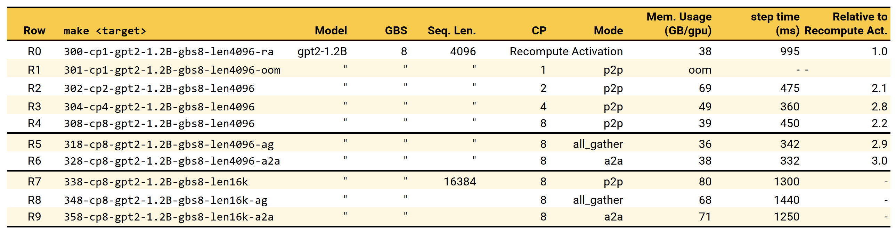

### Context Parallelism

*Main reference: [Megatron Documentation][mcore_cp], [NeMo's Tuning Guide][nemo_cp]*

Up to this point, we have seen how to shard Transformer training across minibatches, gradients, optimizer states, linear weights, and the sequence dimension for normalization and dropout. However, we have not yet addressed how to shard attention itself. That brings us to Context Parallelism (CP).

I'd like to emphasize again (because the terminology can get confusing) the distinction especially in Megatron: **Sequence Parallelism (SP)** shards the input sequence only for normalization and dropout. **Context Parallelism (CP)** shards attention's input Q, K, and V sequences across devices and performs distributed attention. Many papers call this sequence-parallel attention since tokens are split along the sequence axis. Megatron uses the term Context Parallelism to make the distinction explicit from the narrower SP case.

The benefit, however, is clear: CP, like SP, enables scaling to much longer sequence lengths by distributing activations across devices, allowing us to *avoid* storing the full sequence activations on any single GPU while leveraging the compute of many GPUs.

To enable CP in Megatron-LM, simply set `--context-parallel-size` to a value greater than 1. The finer control lies in the `--cp-comm-type` flag, which specifies the communication pattern used for exchanging attention inputs across devices. The flag supports 4 variants `{p2p, all_gather, a2a, a2a+p2p}`, where `p2p` is the default and `a2a+p2p` represents a hierarchical combination of both. Below, we briefly outline how these modes differ in their mechanics, and later use experiments to illustrate their performance characteristics.

**TODO**: add diagrams to contrast the 3.

**Recall the attention operation:** given a sequence, it is first projected into 3 latent representations, Q, K, and V. Each token in Q attends to all tokens in K up to its position using a dot product to measure similarity. The resulting attention scores are normalized with a softmax (and masked if it is causal), and Vs are weighted by the scores and reduce-summed to produce the token’s output. In essence, each token in Q depends on all preceding tokens in K and V. If we partition Q, K, and V along the sequence dimension, each Q shard must have access to all K and V shards to compute attention correctly. The remaining question is how to distribute, gather, and compute while maintaining functional equivalence.

**`p2p`** maps to [Ring Attention][ringattn] in the literature. In spirit, I like to call this *"Distributed" FlashAttention*. Think [FlashAttention][fa], but with added distribution and coordinated communication layered on top. In this setup, Q, K, and V are chunked along the sequence axis, and attention is computed in a streaming fashion across those shards using online softmax normalization, allowing each device to recover the global attention result without ever materializing the full attention matrix. Through this rotation, every device, which holds a static shard of Q, sequentially sees all K and V shards from other devices, enabling each to compute attention over the entire sequence without global synchronization or assembling full activations. Conceptually, this is similar to FlashAttention’s cache-level streaming, except here the "cache" resides at the device level. The ring communication is realized through point-to-point (p2p) sends and receives, which is how it got its name in Megatron and can overlap with computation.

Instead of rotating K and V shards among devices, **`all_gather`** simply collects all K and V shards onto every device so that each Q shard can compute attention locally over the full sequence. This approach simplifies the communication pattern, but no overlap between computation and communication.

**`a2a`** corresponds to the implementation of [DeepSpeed-Ulysses][ulysses]. I must point out, though, that this is technically *not* "sequence" or "context" parallelism because tokens are not split, but rather a form of head-group parallelism. The sequence (tokens) stays intact, each GPU ends up with all tokens, but only for a subset of attention heads, meaning the activation is sharded in the hidden (embedding) dimension instead of sequence axis. The design relies on all-to-all communication to redistribute Q, K, and V so that head-complete shards are collocated on each device. Each device ends up holding all tokens for its assigned heads and simply performs the standard attention computation. 

We now experiment with Context Parallelism (CP) using the default `p2p` mode, following the [documentation][mcore_cp], and compare it against activation recomputation (see [discussion](./02-tp-sp.md#activation-recomputation])). We also highlight cases where other communication modes become useful. Our setup consists of a single node with 8× H100 GPUs, whereas the documentation requires 175B GPT and at least 16 GPUs to show benefits. The model we used is GPT-2 configured to approximately 1.2 B parameters. You can check the script for the exact configuration details.

**R0-R4: Scaling CP using p2p mode**

Naively training a 1.2 B GPT-2 model with a sequence length of 4096 (R1) runs out of memory on a single H100. The usual workaround is to enable activation recomputation/recompute activation (AR or RA), which allows training to proceed at the cost of additional computation. With recomputation enabled (R0), training runs successfully and uses less than half of the GPU memory. But is it fast enough? Can we speed up given more devices? Of course we can use ZeRO, TP, SP, here we focus on CP.

R2, which enables CP=2, allows training to proceed without recomputation. Memory usage per GPU remains high at 69 out of 80 GB, but the training step time improves significantly, running 2.1× faster than the activation recomputation baseline. With CP set to 4 (R3), the speedup reaches 2.8×. At CP = 8 (R4), we begin to see diminishing returns, with performance dropping to 2.2× faster than the baseline. This saturation arises because the effective per-rank sequence length shrinks to 
4096/8, reducing the compute footprint and limiting the ability to overlap attention computation with communication. As a result, communication increasingly becomes the critical path. Nevertheless, the scaling from R1 to R4 clearly demonstrates that memory usage decreases proportionally with CP, highlighting one of the key benefits of CP beyond speedup.

**R4-R6: Ablating different modes**

We next experiment with all_gather (R5) and a2a (R6), keeping all other settings the same as in R4 (CP=8, length 4K). Both modes outperform `p2p` and even surpass the best p2p result in R3, where CP=4. Memory usage per GPU is also improved slightly in both cases.

**R7-R9: Very Long Context**

Let's scale to a much longer context that still fits within 8× H100 using CP. We set sequence length to 16K and compare the 3 modes again. The most time-efficient configuration is `a2a` (R7), while its memory usage sits in the middle. This outcome aligns with [NeMo's tuning guide][nemo_cp], which recommends `a2a` for very long sequences.

In summary, context parallelism provides clear benefits in both memory efficiency and compute performance. In practice, selecting between p2p, all_gather, and a2a largely depends on CP degree and sequence length, which together determine whether communication can be effectively overlapped with computation.

[ringattn]: https://arxiv.org/abs/2310.01889
[ulysses]: https://arxiv.org/abs/2309.14509
[fa]: https://arxiv.org/abs/2205.14135
[mcore_cp]: https://docs.nvidia.com/megatron-core/developer-guide/0.15.0/api-guide/context_parallel.html
[nemo_cp]: https://docs.nvidia.com/nemo/megatron-bridge/latest/performance-guide.html?utm_source=chatgpt.com#long-sequence-train