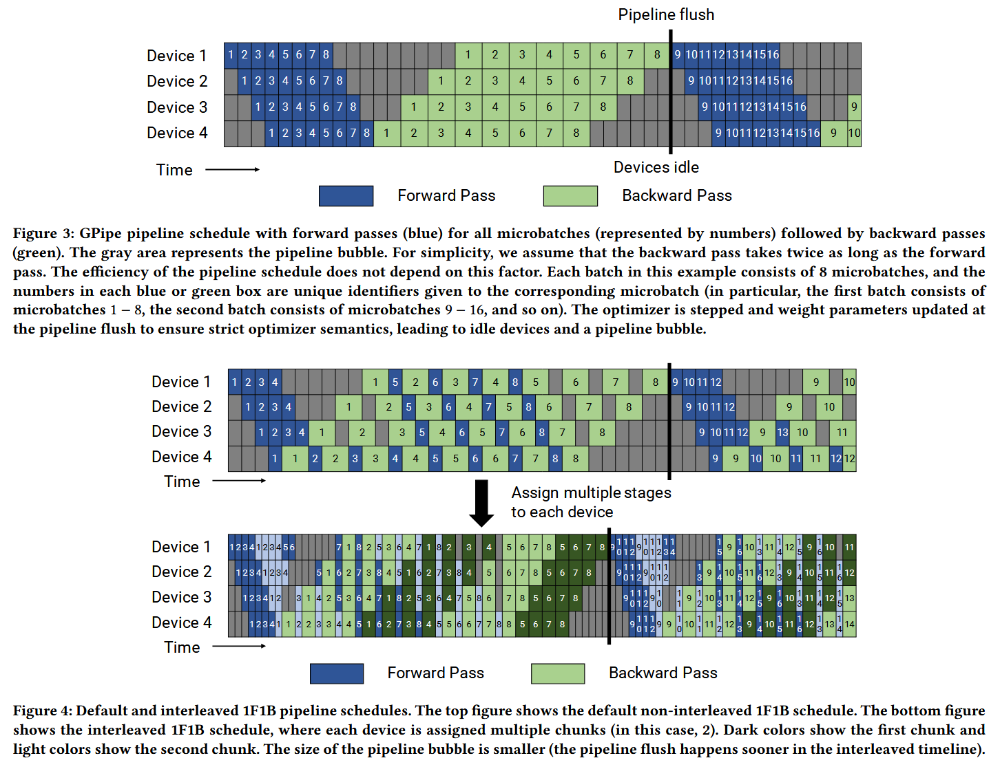
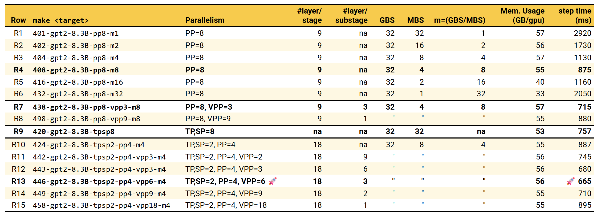

### Pipeline Parallelism (PP) & Virtual PP
*Main reference: [Efficient Large-Scale Language Model Training on GPU Clusters Using Megatron-LM][ptd-p]*

In the question of how to fit a model larger than a single GPU can cope, isn't it obvious to split by layers across devices? While conceptually straightforward, this naive solution is often far from optimal. If we simply feed full minibatches (GBS) through the layers, i.e. sequentially GPU after GPU, only one GPU works at a time while the rest sit idle. Not very efficient. Enter ***pipelining***, a technique commonly used in computer architecture. In the context of model training, it means breaking down a minibatch (GBS) into into smaller microbatches (MBS) and feeding them so that as one GPU finishes processing a microbatch, the next GPU immediately begins its part. In this way, during steady state, multiple devices are working concurrently, keeping all GPUs active.

There are more nuances to pipelining. We won't go into full rigor here, but instead highlight the key considerations that arise. A few terms to be clear on:
- **Microbatch (MBS)**: A smaller subset of the overall minibatch (GBS).
- **Pipeline Stage**: A segment of the model assigned to a specific GPU or set of GPUs.
- **Pipeline Bubble**: Idle time in the pipeline when a stage is waiting for data from the previous stage. When used loosely, bubble simply refers to idle time anywhere in the pipeline, whether in one or multiple stages.
- **Pipeline Flush**: The process of clearing out all microbatches from the pipeline, typically occurring at the end of processing a minibatch.

Key considerations in Pipeline Parallelism:
1. **Mandatory Synchronized Weight Updates** — During backpropagation, gradient computation typically requires both the input (activation) and the weights used during the forward pass. In non-pipelined training, the optimizer can update weights immediately after a backward pass completes for a given layer. In pipelined training, however, this causes a problem: since multiple microbatches are flowing through the pipeline, performing an optimizer step right after a backward pass of one microbatch would mean that subsequent microbatches from the same minibatch *seeing* **updated** weights. This violates the original dynamics of training. A synchronization barrier is therefore required to ensure weight updates happen only after all microbatches have completed their backward pass for a given layer/stage, or simply stepping the optimizer after pipeline flush.

> Figures taken from [Megatron-LM's paper][ptd-p].

2. **From All-Forward-All-Backward (AFAB) to One-Forward-One-Backward (1F1B) Scheduling** — Once we understand the synchronization requirement above, we can turn to how microbatches are scheduled and overlapped in time. The most straightforward approach, known as **AFAB** (Figure 3), runs all microbatches through the forward pass first and only then performs all backward passes. The paper quantifies bubble time fraction as $(P-1)/m$ where $P$ is number for pipeline stages and $m$ is number of microbatches. Clearly, to reduce bubbles, $𝑚≫𝑃$. In other words, *more microbatches are better; fewer stages are better*.

    Less stages are trivial, we all begin with no stages, entire model on single GPU, so $P$ is usually fixed by design because we want to train large model.To increase $m$, we can either increase GBS or decrease MBS, or both. So why not just make the largest GBS and smallest MBS we can? Life isn’t that simple. 😁 After a certain point, compute utilization drops as the per-microbatch workload becomes too small. In practice, MBS can be tuned to balance bubble reduction and compute efficiency, but the main limitation often comes from scaling up GBS to achieve a high $m$. Recall that we must keep the input activations of all in-flight microbatches until their backward passes complete, that's piling up memory usage, quickly hitting the capacity limit.

    To overcome this, a smarter scheduling strategy called **1F1B** is proposed (Figure 4, top). The name comes from: a new microbatch is launched only when one microbatch completes both forward and backward on a given stage. This allows us to control the memory footprint by limiting the number of in-flight microbatches while still reaching the intended global batch size (GBS). You can see this dynamic clearly in the diagram: (1) note how the microbatch 5 follows the backward of microbatch 1, and how 2 ends as 6 begins, continuing until microbatch 8; (2) observe that the vertical black line, the weight updates align for AFAB and 1F1B, meaning they share the same bubble time fraction. In essence, 1F1B achieves the same training speed as AFAB while being far more memory-efficient.

3. **Shrinking Bubbles by Interleaving Layers Within a Stage** (Figure 4, bottom) — Faster training, fewer bubbles! I'll admit, the first time I looked at the diagram, I was intimidated too. It’s okay, take more passes, it will start to make sense. 

    One way to think about pipeline bubbles is through granularity: the coarser each stage is, the larger the idle gaps between them. In the extreme, if every individual operation ran on its own device, these gaps would nearly vanish, perfect overlap, zero bubble. 

    **Virtual Pipeline Parallelism (VPP)** applies this idea. We obviously can't have infinite devices to assign one operator per stage, but we can virtually create multiple stages within each GPU (stage). Instead of treating a stage as one contiguous block of layers, we split it into smaller sub-stages and interleave their execution across devices, i.e. while one GPU is computing sub-stage A for a certain microbatch, another GPU can already start sub-stage B for a different microbatch, so computation and communication overlap naturally. In Figure 4, notice how the dark blue microbatches overlap. The light blue ones represent the same microbatches returning to the same device to execute the next virtual sub-stage. The same mechanism applies to the backward passes, shown in dark and light green. Finally, look at the weight update lines: in VPP they appear earlier than in regular PP, which means the bubbles shrink and the whole pipeline runs faster.

    Wow, magic! But as with most tricks, there's a cost. If you imagine the process carefully, you'll notice that the activation p2p communication scales with the number of sub-stages. No free lunch here: more interleaving means more communication, leading to diminishing returns. We'll illustrate this trade-off clearly in our hands-on experiments later.

**Hands-on time!** The paper experiments with mega-scale models combining PP, TP, and DP. We couldn't find a configuration that fits our single-node 8×H100 setup, so our main focus is to study the effects of PP and VPP in isolation. Since PP is often compared or combined with TP, we start with the model used in our [earlier][our-tp-weak] TP weak-scaling experiments: a GPT-2 configured with 8.3B parameters. Enabling pipeline parallelism is as simple as adding the flags `--pipeline-model-parallel-size 
` and `--num-layers-per-virtual-pipeline-stage <V>` for VPP. See the provided scripts for full configuration details.

**R1–R6: Effect of Microbatch Count on Pipeline Efficiency**

The first set of runs explores pure pp with a fixed 8 stages while sweeping the number of microbatches ($m$). For this 72-layer model, **PP=8** means each stage holds 9 layers. We fix GBS=32 and vary MBS from 32 down to 1, $m$ =GBS/MBS. Recall the bubble fraction is given by $(P-1)/m$; with $P=8$ fixed, a larger $m$ means smaller bubbles and better step time.  

As observed in **R1–R4**, where we progressively reduce MBS (hence increasing $m$), the training step time improves substantially from 2920 down to 875 ms/step, a **3.34× speedup**. However, in **R5** and **R6**, further increasing $m$ results in slower training. This is due to the 1F1B scheduling in Megatron-LM (the only mode currently supported, though ideally we would compare with AFAB). **1F1B** limits the number of in-flight microbatches to the pipeline depth $P$ to control memory usage. When $m \gg P$, only $P$ microbatches can be active at a time, while the remaining $m-P$ are stalled, waiting for their turn to enter the pipeline, this queuing effectively creates bubbles. As a result, larger $m$ beyond $P$ leads to *longer* step times, which is exactly what we see in R5 and R6. In our local experiments across several models and configurations, choosing the largest $m$ less than or equal to $P$ consistently gives the best performance, supporting this reasoning.

**R7–R8: VPP helps! But not always.**  

The next question is: can VPP help? We start from **R4**, the best run in the first set, and enable VPP. Note that the number of layers per stage must be divisible by the VPP degree. For our 9-layer stage, this gives only 3 valid options: 1,3, 9. Since VPP=1 is equivalent to pure PP, we experiment with VPP {3, 9}, corresponding to 3 layers per sub-stage and 1 layer per sub-stage, respectively.  

As shown in **R7 (VPP=3)**, introducing VPP indeed helps, step time drops from 875 to 715 ms/step, that is about 22% lower! However, **R8 (VPP=9)** performs worse, roughly returning to the level without VPP. This degradation is caused by the proportional increase in communication overhead as the number of virtual substages grows, consistent with our earlier discussion.

**R9: Life Is Easy with TP and SP.** 

Since TP is often compared against PP, we include a reference run with **TP=8** and **SP enabled**. The performance actually surpasses the best **PP=8, VPP=3, m=8** configuration. Implementation-wise, I feel that **TP+SP** is simpler than **PP/VPP**, fewer moving parts, fewer things to tune.

## R10–R15: Megatron, Transformed! 😎 TP + SP + PP + VPP

Would a combination of all parallelism strategies work even better? There are many possible configuration permutations to explore, but here we capture only the best-performing ones to keep the message clear and leave the rest as an exercise.  

We start with **R10**, following hunch: since this isn't a very large model, **TP=2** should be sufficient, larger TP would make each shard's compute too small to stay efficient. This leaves **PP=4**, resulting in 18 Transformer layers per stage. From our earlier results, $m$ should be close to $P$, so we set MBS=8 to make $m=4$. **SP** is enabled. Right off the bat, we observe **887 ms/step**. Not impressive, nearly the same as pure PP-only (**R4**).

Next, we turn on **VPP**. With 18 layers per stage, valid VPP degrees are **2, 3, 6, 9, and 18** (1 being pure PP). Sweeping across them, **R13 (TP,SP=2, PP=4, VPP=6, m=4)** ***outperforms*** both PP/VPP or TP/SP alone, reaching **665 ms/step**, a **7.5%** improvement over the second-best (R7). Is it worth it? Depends on scale. If training a model like GPT-4 [reportedly][gpt-4-cost] costs around **$100 million**, that 7.5% gain would translate to roughly **$7.5 million saved**! Of course, not directly comparable, just to illustrate that even a single percent matters at that scale.

In short, multi-axial parallelism pays off but this is just the beginning. We haven't even added more GPUs, CP, FSDP, or EP into the mix yet! The combinatorial space is massive, and we've only scratched the surface. *Now, Your turn :) [Happy Transform and Roll Out!][youtube-megatron]*

[our-tp-weak]: ./02-tp-sp.md#weak-scaling
[ptd-p]: http://arxiv.org/abs/2104.04473
[gpt-4-cost]: https://en.wikipedia.org/wiki/GPT-4#:~:text=Sam%20Altman%20stated%20that%20the,51
[youtube-megatron]: https://youtu.be/BYOWdUiflTg?si=wBfupgv46TLkwMfo