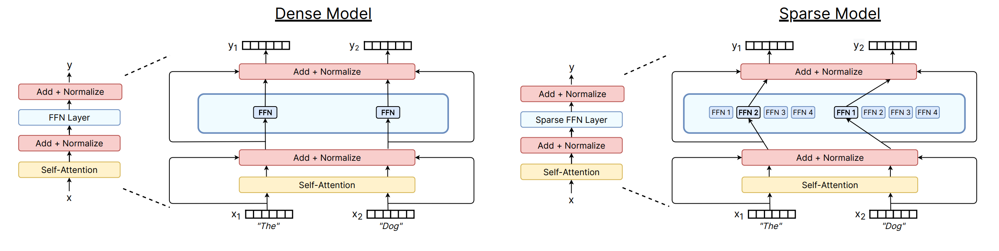
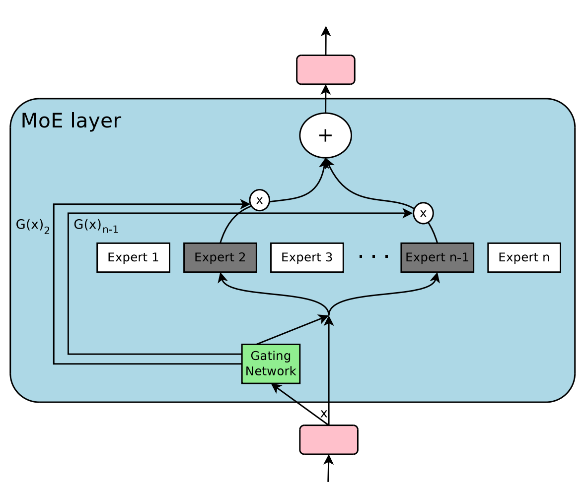
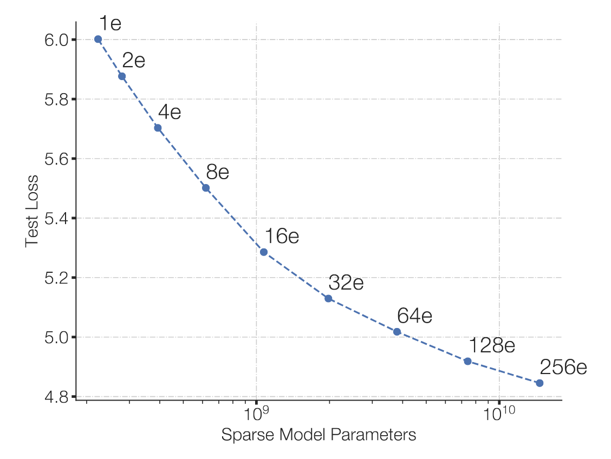
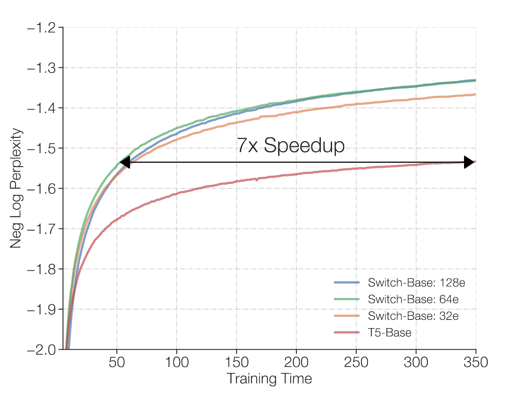
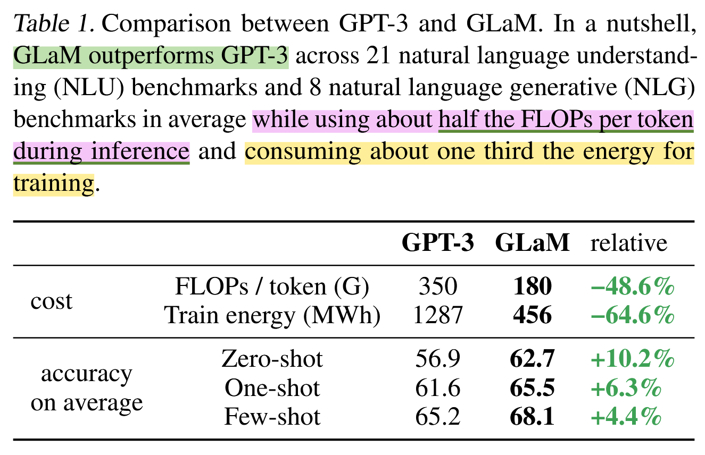

### Expert Parallelism

What is the state-of-the-art? As of Q4 2025, virtually all frontier labs' flagship (Multimodal) LMs are Mixture-of-Experts (MoE).

* Google’s Gemini Pro series, from [1.5][gpro-1.5-blog] to [2.5][gpro-2.5-arxiv], are MoEs. No surprise, Google Research pioneered the paradigm.

* OpenAI is broadly [believed][gpt-4-dig] to have adopted MoE since GPT-4, and in August 2025, its first open-weight releases since GPT-2, [GPT-OSS][gpt-oss-blog], are MoE-only at 20B and 120B size.

* To our knowledge, [Mistral's Mixtrals][mixtral-blog] are the first open-weight MoEs (Dec 2023).

* [DeepSeek-R1][ds-r1], the model that sent [shockwaves][ds-shockwave] through markets in early 2025, is an RL derivative of its MoE-based [DeepSeek-V3][ds-v3].

* See [Meta's herd][llama4-herd].

* [Alibaba's Qwen][qwen3-arvix]? 🥱

* [Kimi-K2][kimi-k2], the new bright kid on the block.

[gpro-1.5-blog]: https://blog.google/technology/ai/google-gemini-next-generation-model-february-2024/#architecture
[gpro-2.5-arxiv]: https://arxiv.org/abs/2507.06261
[gpt-oss-blog]: https://openai.com/index/introducing-gpt-oss/
[gpt-4-dig]: https://the-decoder.com/gpt-4-architecture-datasets-costs-and-more-leaked
[mixtral-blog]: https://mistral.ai/news/mixtral-of-experts
[ds-r1]:https://arxiv.org/abs/2501.12948
[ds-v3]: https://arxiv.org/abs/2412.19437
[ds-shockwave]: https://www.theguardian.com/business/2025/jan/27/tech-shares-asia-europe-fall-china-ai-deepseek
[llama4-herd]: https://ai.meta.com/blog/llama-4-multimodal-intelligence/
[qwen3-arvix]: https://arxiv.org/abs/2505.09388
[kimi-k2]: https://moonshotai.github.io/Kimi-K2/

**Should we pay attention? And why? Let's briefly review and get to the evidence.**

Scaling model size has been the dominant force of LM improvement. Early GPT models already illustrated this trend: GPT-1 (117M), GPT-2 (1.5B), and GPT-3 (175B) each delivered lower training loss but, more importantly, few-shot and emergent capabilities. This empirical pattern was later formalized by scaling-law studies such as [Kaplan et al. (2020)][kaplan2020] and [Chinchilla's compute-optimal findings][chinchilla2022], both reinforcing that larger models predictably yield better performance, granted at growing computational cost.

The next question is *can we scale parameters without scaling computation?* That is the premise of Mixture-of-Experts (MoE) models, decoupling computation growth from parameter growth.

The core idea of MoE is to grow model capacity by widening the MLP layers, while keeping computation fixed by conditionallly activating only a subset of the parameters per token. Structurally, the MLP of a vanilla decoder-only (GPT) transformer is replaced by multiple "expert" MLPs, and a "router" (a.k.a gating) network. The router network is simply a classifier to predict which experts to use for each input token, the router is basically the classic softmax-based multi-class network. How many experts per token is a hyperparameter, usually denoted as k, top k of experts predicted by router. When k > 1, output of top-K experts are weighted by the softmax-normalized scores of router network. when k=1, the computation cost is roughly the same as dense model with same hidden size with small routing cost.

> Notice the Mixture-of-FFNs on the right, do constrast to dense on the left. Routing network abstracted here. Extracted from [Fedus, Zoph et al. 2022][fedus-moe-review].

> An MoE layer, with router (gating) network, expert 1 .. n map to FFN1 .. FFN4 above. Extracted from [Noam et. al. 2017][noam-iclr-2017].

The core idea of MoE is to grow model capacity by widening the MLP (FFN) layers, while keeping computation fixed by conditionally (sparsely) activating only a subset of parameters per token. Structurally, the MLP in a transformer is replaced by multiple expert MLPs together with a router (or gating) network. The router is simply a classifier that predicts which experts should process each input token, it is essentially a softmax-based multi-class layer.

The number of selected experts per token is a hyperparameter, usually denoted as k, referring to the top-k experts chosen by the router. When k>1, the outputs of the chosen experts are combined (weighted sum) using the router's softmax-normalized scores. When k=1, the computation is roughly identical to a dense model with the same hidden size, aside from a small routing overhead. 

**Think about what this implies:** with k=1, we can scale to an arbitrarily large number of experts while keeping the per-token computation essentially constant! Of course, larger k values are also used in practice, but k=1 cleanly illustrates the idea of bounding computation. Higher k complicates the picture because different experts may receive different numbers of tokens, leading to imbalance load among experts, making compute comparisons less straightforward.

Math formula may help clarify. 

For each token representation x, the router network computes a score vector over all experts:

$$G(x)= softmax(x W_g)$$

For each expert i of the top-k experts selected:

$$y_i = mlp_i(x)$$

Weighted sum of the selected experts' outputs gives the final output:

$$y = \sum_{i \in k} g_i(x) \cdot y_i$$

Isn't it simple and elegant? Yes but the complexity lies in routing implementation and training stability. **TODO** expand up to related to Megatron-LM implementation.

### Evidence of MoE Effectiveness

**Fulfiling the promise of constant compute cost, more parameters, better model quality.** The [Switch Transformer][switch-moe] plot shows models with increasing numbers of experts, all trained under identical budgets (same FLOPs, training steps, and tokens seen) by activating only one expert per token. The key takeaway: test loss improves as expert count increases, while computation remains essentially constant.

**Superior Sample Efficiency, Convergence Speedup.** The [plot][switch-moe] above shows convergence trajectories per training time (steps), where higher negative log perplexity is better.  Main point is to match the quality of a dense T5 baseline, an MoE requires as few as 32 experts and only about 1/7 the number of steps. That's 7× faster convergence, translating to 7× lower total training cost, while inference remains at the same compute cost as a T5.

**_The ultimate take-my-money evidence_** 💪🚀😂

*"The largest GLaM has 1.2 trillion parameters, which is approximately 7x larger than GPT-3. It consumes only 1/3 of the energy used to train GPT-3 and requires half of the computation flops for inference, while still achieving better overall zero, one and few-shot performance across 29 NLP tasks."* — [from GLaM abstract][glam-arxiv].

* [ ] *To be continued... we are tweaking Megatron-LM's MoE experiments, mainly on how to fit within 8xH100, how to show MoE compute advantage only from training perspective because this is a Megatron-LM tutorial and complete training is practically impossible for mere mortals (you might have a chance if your first name starts with E, M, S, L or J. Get it? 🤣). Jokes aside, we are also considering to factor in Megatron's [new MoE parallel folding][moe-fold]. Stay tuned. ETA: end of Nov 25. *

[glam-arxiv]: https://arxiv.org/abs/2112.06905v2
[noam-iclr-2017]: https://arxiv.org/abs/1701.06538
[fedus-moe-review]: https://arxiv.org/abs/2209.01667
[switch-moe]: https://arxiv.org/abs/2101.03961v3
[kaplan2020]: https://arxiv.org/abs/2001.08361
[chinchilla2022]: https://arxiv.org/abs/2203.15556
[moe-fold]: https://arxiv.org/abs/2504.14960