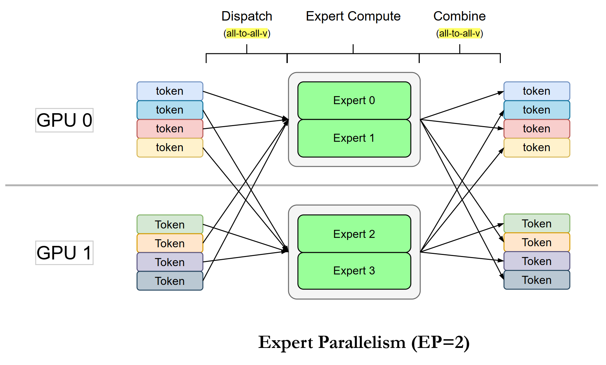
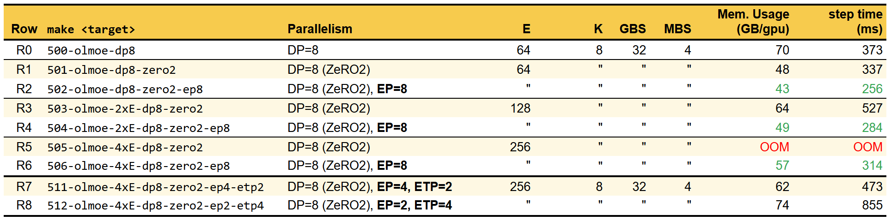

### Expert Parallelism

What is the state-of-the-art? As of Q4 2025, virtually all frontier labs' flagship (Multimodal) LMs are Mixture-of-Experts (MoE).

* Google’s Gemini Pro series, from [1.5][gpro-1.5-blog] to [2.5][gpro-2.5-arxiv], are MoEs. No surprise, Google Research pioneered the paradigm.

* OpenAI is broadly [believed][gpt-4-dig] to have adopted MoE since GPT-4, and in August 2025, its first open-weight releases since GPT-2, [GPT-OSS][gpt-oss-blog], are MoE-only at 20B and 120B size.

* To our knowledge, [Mistral's Mixtrals][mixtral-blog] are the first open-weight MoEs (Dec 2023).

* [DeepSeek-R1][ds-r1], the model that sent [shockwaves][ds-shockwave] through markets in early 2025, is an RL derivative of its MoE-based [DeepSeek-V3][ds-v3].

* See [Meta's herd][llama4-herd].

* [Alibaba's Qwen][qwen3-arvix]? 🥱

* [Kimi-K2][kimi-k2], the new bright kid on the block.

[gpro-1.5-blog]: https://blog.google/technology/ai/google-gemini-next-generation-model-february-2024/#architecture
[gpro-2.5-arxiv]: https://arxiv.org/abs/2507.06261
[gpt-oss-blog]: https://openai.com/index/introducing-gpt-oss/
[gpt-4-dig]: https://the-decoder.com/gpt-4-architecture-datasets-costs-and-more-leaked
[mixtral-blog]: https://mistral.ai/news/mixtral-of-experts
[ds-r1]:https://arxiv.org/abs/2501.12948
[ds-v3]: https://arxiv.org/abs/2412.19437
[ds-shockwave]: https://www.theguardian.com/business/2025/jan/27/tech-shares-asia-europe-fall-china-ai-deepseek
[llama4-herd]: https://ai.meta.com/blog/llama-4-multimodal-intelligence/
[qwen3-arvix]: https://arxiv.org/abs/2505.09388
[kimi-k2]: https://moonshotai.github.io/Kimi-K2/

**Should we pay attention? And why? Let's briefly review and get to the evidence.**

Scaling model size has been the dominant force of LM improvement. Early GPT models already illustrated this trend: GPT-1 (117M), GPT-2 (1.5B), and GPT-3 (175B) each delivered lower training loss but, more importantly, few-shot and emergent capabilities. This empirical pattern was later formalized by scaling-law studies such as [Kaplan et al. (2020)][kaplan2020] and [Chinchilla's compute-optimal findings][chinchilla2022], both reinforcing that larger models predictably yield better performance, granted at growing computational cost.

The next question is *can we scale parameters without scaling computation?* That is the premise of Mixture-of-Experts (MoE) models, decoupling computation growth from parameter growth.

The core idea of MoE is to grow model capacity by widening the MLP (FFN) layers, while keeping computation fixed by conditionally (sparsely) activating only a subset of parameters per token. Structurally, the MLP in a transformer is replaced by multiple expert MLPs together with a router (or gating) network. The router is simply a classifier that predicts which experts should process each input token, it is essentially a softmax-based multi-class layer.


> Extracted from [Fedus, Zoph et al. 2022][fedus-moe-review]. Notice the Mixture-of-FFNs on the right, do constrast to dense on the left. Routing network is not shown above but below.


> An MoE layer, with router (gating) network, expert 1 .. n map to FFN1 .. FFN4 above. Extracted from [Noam et. al. 2017][noam-iclr-2017].


The number of selected experts per token is a hyperparameter, usually denoted as k, referring to the top-k experts chosen by the router. When k>1, the outputs of the chosen experts are combined (weighted sum) using the router's softmax-normalized scores. When k=1, the computation is roughly identical to a dense model with the same hidden size, aside from a small routing overhead. 

**Think about what this implies:** with k=1, we can scale to an arbitrarily large number of experts while keeping the per-token computation essentially constant! Of course, larger k values are also used in practice, but k=1 cleanly illustrates the idea of bounding computation. Higher k complicates the picture because different experts may receive different numbers of tokens, leading to imbalance load among experts, making compute comparisons less straightforward. Therefore studies requiring iso-compute comparison against dense transformer normally use k=1.

Now, the math formula may help clarify MoE layer. 

For each token representation x, the router network computes a score vector over all experts:

$$G(x)= softmax(x W_g)$$

The top-k experts are selected according to the largest gating (router) scores:

$$ E_k(x) = \mathrm{TopK}(G(x)) $$

For each expert i of the top-k experts selected:

$$y_i = mlp_i(x)$$

Weighted sum of the selected experts' outputs gives the final output:

$$y = \sum_{i \in E_k} g_i(x) \cdot y_i$$

Isn't it simple and elegant? Conceptually, yes. In practice, the complexity of MoE lies not in the formulation above, but in routing implementation, training stability, and *most critically, load balancing*. Uneven load of among experts quickly degenerates into hardware underutilization and expert learning collapse.

This chapter is **not** a comprehensive treatment of MoE modeling or training dynamics. Our focus here is Expert Parallelism (EP) as a systems and scaling mechanism. Specifically, how EP is realized in Megatron and a tutorial on **how to use EP in Megatron to enable efficient MoE training**. We particularly recommend this [MoE review][fedus-moe-review], [OLMoE][olmoe] papers. For hands-on experimentation and ablation-driven analysis, we further point to our [moe-lab][moe-lab], which explores MoE design choices using a single gpu, including DeepSeek-V3 load-balancing biasing that is rarely ablated in the literature.

Just before turning to Megatron EP, we review key empirical evidences that establish MoE as an increasingly inevitable choice for large-scale models.

### Evidence of MoE Effectiveness


**Fulfiling the promise of constant compute cost, more parameters, better model quality.** The [Switch Transformer][switch-moe] plot shows models with increasing numbers of experts, all trained under identical budgets (same FLOPs, training steps, and tokens seen) by activating only one expert per token. The main observation: *test loss improves as expert count increases, while computation remains essentially constant*.


**Superior Sample Efficiency, Convergence Speedup, Iso-Compute Inference** The [plot][switch-moe] above shows convergence trajectories per training time (steps), where higher negative log perplexity is better.  Main point is to match the quality of a dense T5 baseline, an MoE requires as few as 32 experts and only about 1/7 the number of steps. That's 7× faster convergence, translating to 7× lower total training cost, while inference remains at the same compute cost as a T5.


**_The ultimate take-my-money evidence_** 💪🚀😂

*"The largest GLaM has 1.2 trillion parameters, which is approximately 7x larger than GPT-3. It consumes only 1/3 of the energy used to train GPT-3 and requires half of the computation flops for inference, while still achieving better overall zero, one and few-shot performance across 29 NLP tasks."* — [from GLaM abstract][glam-arxiv].


##
### EP in Megatron-LM
*Main reference: [MoE Parallel Folding][moe-fold]*

Megatron exposes over 30 arguments related to MoE/EP in `pretrain_gpt.py`, which can be daunting at first. Fret not, we introduce the minimum set of arguments required to get started with Expert Parallelism (EP), specifically for training performance studies:
```
MOE_ARGS=(
    --num-experts                      <#experts>
    --moe-router-topk                  <#activated_experts>
    --moe-ffn-hidden-size              <#ffn_dim>
    --expert-model-parallel-size       <#EP>
    --moe-grouped-gemm                 # efficient expert-parallel GEMMs
    --moe-permute-fusion               # fused token permutation prior to routing
    --moe-token-dispatcher-type        {allgather,alltoall,flex}  # routing communication backend
    --moe-router-force-load-balancing  # benchmarking only: enforce balanced routing
)
```
With the arguments above:
* The GPT MLP is replaced by an MoE layer with `--num-experts` experts, each having an intermediate (Up / Gate) dimension of `--moe-ffn-hidden-size`.
* Each token activates `--moe-router-topk` experts.
* `--expert-model-parallel-size` specifies EP degree. The number of expert per EP rank is simply `#experts/#EP`. When EP is mapped one-to-one with GPUs, this is also the number of local experts per GPU.
* `--moe-grouped-gemm` enables grouped GEMM, an efficient kernel that batches many small expert GEMMs into a single high-utilization launch. This [PyTorch blog][group-gemm-blog] provides an excellent discussion of the kernel design and related optimizations, and this option is almost always enabled in practice.
* `--moe-permute-fusion` enables efficient reordering tokens by destination EP rank prior to token dispatching.
* `--moe-token-dispatcher-type` selects the routing communication backend (allgather, alltoall, or flex). We will discuss more about the EP comm later.

* Without `--moe-router-force-load-balancing`, expert load can be highly imbalanced early in training, introducing large variance into perf measurements. Since benchmarking cannot wait for full convergence (or rely on pretrained giant models), Megatron provides this handy option to enforce balanced routing with randomly assigned experts. We enable this option for all performance benchmarks.

**Note:** The arguments above are sufficient for performance benchmarking, with all other MoE-related options kept at their defaults. In practical MoE training, modeling related parameters (e.g., `--moe-router-load-balancing-type`, `--moe-aux-loss-coeff`, `--moe-z-loss-coeff`) must be tuned. These modeling considerations are intentionally left out of scope, as this tutorial focuses on EP perf advantage.
#### EP Communication Patterns

The figure below illustrates the execution and communication mechanics of Expert Parallelism (EP) using a toy example. We consider an MoE layer with 4 experts, configured with EP=2 across 2 GPUs, where each EP rank hosts 2 distinct experts. Although not shown explicitly, the upstream layers (e.g., attention and router) operate with DP=2, each processing a microbatch of 4 tokens.

End-to-end execution of an EP layer consists of three stages: **Dispatch, Expert Compute, and Combine**. The router assigns each token to its destination expert (indicated by color). Tokens routed to local experts remain on the same rank, while others must be sent to remote ranks. The **Dispatch** stage performs this redistribution via an all-to-all-v collective. After expert computation, the **Combine** stage executes another all-to-all-v, returning expert outputs to their original token order and owning ranks.

While the figure depicts the forward pass, the backward pass is *conjugate*, the same communication pattern in reverse: the Combine all-to-all-v becomes a Dispatch, followed again by expert-local grad computation and an all-to-all-v. In other words, you can think of it as simply flipping the arrows in the figure.



In Megatron's implementation, a dispatcher encapsulates both the Dispatch and Combine phases. The term *all-to-all* earlier is simply a convenient way to describe this __token shuffling__ using collective communication terminology. Megatron exposes this logic through an extensible abstraction that supports multiple communication backends, configured via `--moe-token-dispatcher-type`.

Currently, token routing can be implemented using `allgather`, `alltoall`, or `flex`. The `flex` option includes state-of-the-art implementations such as **DeepEP** and **HybridEP**, which we do not cover in this tutorial (they also require custom builds). To keep things simple and to clearly illustrate scaling behavior, we use `alltoall` in the experiments that follow.

### Hands-on

We follow the spirit of [MoE Parallel Folding][moe-fold] to study how MoE models scale in different combinations of parallelism axes. The paper evaluates multiple large MoE configurations, requiring anywhere from 128 to 1024 H100 GPUs, with the smallest model studied being a 57B Qwen2 MoE. These are well beyond the scope of our modest 8×H100 setup.

Instead, we turn to [OLMoE][olmoe], one of the smallest open-source MoE models available, with 7B total params and only ~1B activated per token. Briefly, the OLMoE configuration consists of 16 transformer blocks, 64 experts, and top-8 routing per token. Using this model, we compare vanilla DP, DP with ZeRO-2, EP, while scaling the number of experts. We also study TP over experts (ETP), which is one of the central ideas of the paper to use independent parallel mapping in attention and MoE layer. All experiments use a GBS of 32 and a MBS of 4 with sequence of 4096 tokens.




**R0-R2**: No surprises here. Enabling ZeRO-2 (R1) immediately improves both memory usage and step time compared to vanilla DP=8 (R0). Introducing EP in R2 further reduces memory footprint and improves step time by nearly 25% relative to R1 (337 ms → 256 ms).

Where does this efficiency come from? Recall that DP, even with ZeRO2 (only shards optimizer and grad states), still replicates the model across ranks, whereas EP splits number of experts across the ranks. In this setup, 64 experts across 16 layers are fully replicated across 8 DP ranks, but under EP=8, each rank hosts only 64 / 8 = 8 experts per layer. This alone explains the memory savings. The effect is more pronounced when we scale to more experts later.

On the compute side, EP routes (batches) all tokens assigned to an expert to its rank, improving arithmetic intensity and kernel efficiency, whereas DP spreads tokens thinly across replicated experts, increasing kernel launch overhead without increasing useful work.

**R1-R6**: We scale the number of experts to 2× and 4× the original 64 experts while keeping 8 experts activated per token. The results show that EP exhibits significantly flatter memory growth than DP, even with ZeRO-2. DP+ZeRO-2 encounters OOM at 256 experts, while EP continues to scale.

Training step time follows the same trend. EP consistently delivers better scaling efficiency as expert count increases. The underlying reason is unchanged. EP partitions experts instead of replicating them. What these results make clear is that EP scales gracefully with MoE capacity, helping explain why today's frontier models can employ extremely large expert counts.

**R7-R8** explores TP sharding on top of EP. Concretely, the set of experts of each EP rank is further sharded across TP ranks. Compared to R6, neither configuration improves memory usage or training step time. This behavior is expected. TP sharding requires replicating input tokens across TP ranks, increasing the volume of all-to-all communication. For OLMoE, where expert compute is relatively lightweight, this added communication overhead dominates. As a result, higher expert TP (ETP) in R8 leads to worse performance.

[glam-arxiv]: https://arxiv.org/abs/2112.06905v2
[noam-iclr-2017]: https://arxiv.org/abs/1701.06538
[fedus-moe-review]: https://arxiv.org/abs/2209.01667
[switch-moe]: https://arxiv.org/abs/2101.03961v3
[kaplan2020]: https://arxiv.org/abs/2001.08361
[chinchilla2022]: https://arxiv.org/abs/2203.15556
[moe-fold]: https://arxiv.org/abs/2504.14960
[olmoe]: https://arxiv.org/abs/2409.02060
[moe-lab]: https://github.com/vuiseng9/moe-lab
[group-gemm-blog]: https://pytorch.org/blog/accelerating-moes-with-a-triton-persistent-cache-aware-grouped-gemm-kernel/