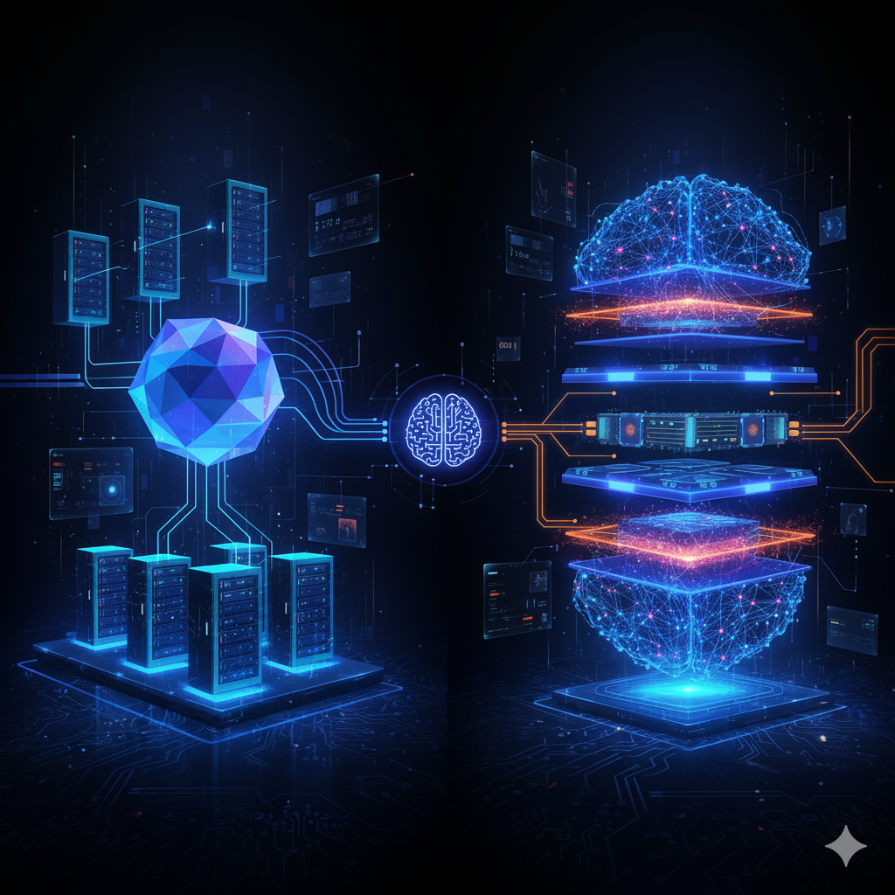

## Megatron, Transformed! 😎
*A Hands-on Megatron-LM Tutorial on Replicating Empirical Trends in Distributed Training and Model Parallelism*

[Megatron-LM][mlm-gh] is, without question, one of the most impressive frameworks advancing and enabling ultra-large model training. But just how many arguments are there in [`pretrain_gpt.py`][mlm-pretrain-gpt]? Over 500. 😅 

>*How many GPUs do we need to get started?
How and what should we set?
Which axis of parallelism should we scale first?
Why am I getting out-of-memory (OOM) all the time? Okay, it’s finally running… but is it even correct? is the performance as expected?*

This tutorial series is written to address those pain points. It provides a set of curated, ready-to-run (hack) experiments designed to reduce the friction of getting started with Megatron-LM. Each tutorial explains the core concept succinctly, isolates and ablates one parallelism strategy at a time, and, wherever possible, aligns with the main paper to reproduce empirical scaling trends reported to verify both correctness and understanding.

All experiments are designed to run on a single node with 8×H100 80 GB GPUs. Performance and memory metrics are meticulously tabulated for your own cross-reference and verification.The goal is to make Megatron-LM more accessible, reproducible, and tinker-friendly.

Explore:

* [Data Parallelism & ZeRO-2](./01-dp-zero2.md): Sublinear Memory Growth for Scaling Up Batch and Model Size.
* [Tensor Parallelism](./02-tp-sp.md): Intra-layer Parameter Sharding for Larger Models, per Paper’s Strong and Weak Scaling.
* [Sequence Parallelism](./02-tp-sp.md#sequence-parallelism): Turns Activation Duplication into Partitions, Bypassing Recomputation.
* [Context Parallelism](./03-cp.md): Extending Sequence Parallelism to Attention and Variants in Megatron.
* [(Virtual) Pipeline Parallelism](./04-pp-vpp.md): Inter-layer Model Sharding, Scheduling, and Layer Interleaving for Reduced Bubbles.
* [In Progress] Expert Parallelism: Mixture of Experts (MoE) for Scaling Model Capacity with Conditional Compute.

-----
### Setup and Run

We rely on the out-of-the-box Megatron-LM's `pretrain_gpt.py` and use bash scripts to wrap it with different parallelism strategies. We also use `Makefile` extensively to organize and manage the experiments. 

Easiest way to get started is to use prebuilt docker image:
```
docker run -d --gpus all -it --rm \
  --network=host --ipc=host \
  --shm-size=16g \
  --ulimit memlock=-1 --ulimit stack=67108864 \
  vuiseng9/megatron-tutorials
```
Or build using `docker/Dockerfile`.

**How to run? Just `make <id>-tab-completion`** 
* The docker entrypoint will lead to working directory, `/workspace/megatron-lm/examples/`
* Each experiment is defined as a Makefile target prefixed with a unique id, you can see the target corresponding to a row in the tables below. Our intent is to reduce the number of bash scripts, instruction steps/argument, making the runs less friction to reproduce, basically just type make then the id and finally a tab to complete the target. e.g. type `make 101<tab>` turn into `make 101-gpt2xl-dp1-gbs1-bf16`.
* Metrics can be found in std output which is also logged to `./outdir/<experiment label>/logs.txt`. To see GPU memory usage, run `monitor-gpu` on a seperate terminal. Most runs stop after 100 training steps.

**System requirements**: Our results are collected on a single node with 8x H100 80GB SXM5 (NVLink) GPUs. 8xA100 80GB GPUs should give similar trend.



> Generated by Gemini Pro with prompt *"Visualizing Distributed Training and Model Parallelism"*

[mlm-gh]: https://github.com/NVIDIA/Megatron-LM
[mlm-pretrain-gpt]: https://github.com/NVIDIA/Megatron-LM/blob/core_v0.14.0/pretrain_gpt.py

```
@misc{chua2025megatrontransformed,
  title        = {Megatron, Transformed! A Hands-on Megatron-LM Tutorial on Replicating Empirical Trends in Distributed Training and Model Parallelism},
  author       = {Chua, Vui Seng},
  year         = {2025},
  url          = {https://github.com/vuiseng9/megatron-tutorials},
}
```
